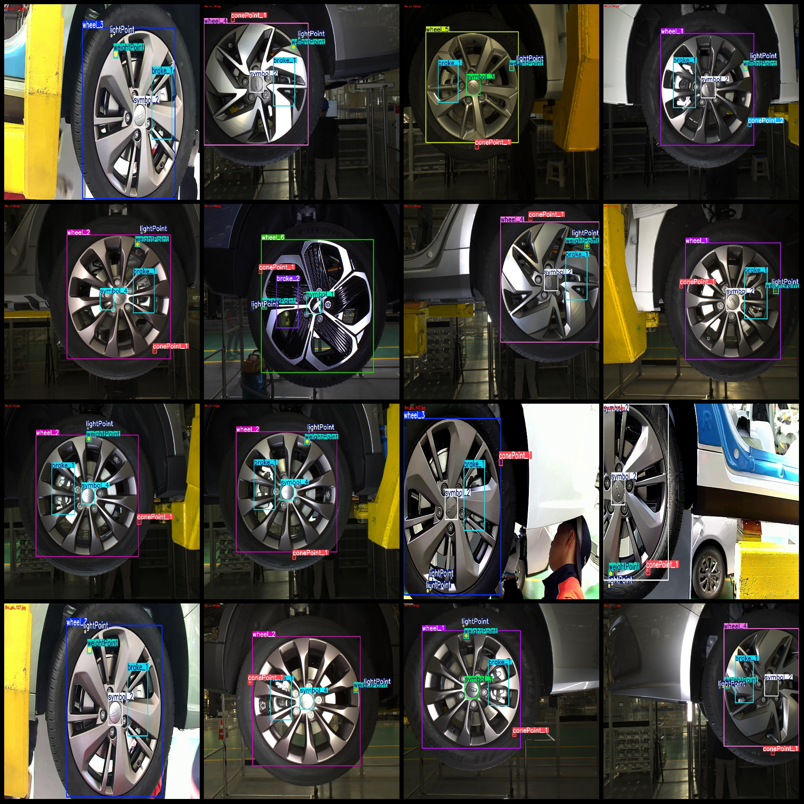
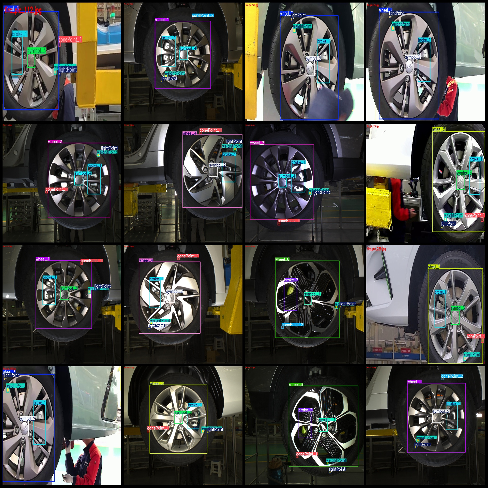

# Vehicle Wheel Hub Braking Point Detection Data Set VOC+YOLO Format with 299 Images of 16 Categories

## Dataset Format
- **Pascal VOC format** + **YOLO format** (excluding split path's txt file, only containing jpg images and corresponding VOC format xml files and YOLO format txt files)
- **Number of images**: 299 jpg files
- **Number of annotations**: 299 xml files
- **Number of annotations**: 299 txt files
- **Number of annotation categories**: 16
- **Annotation category names**: ["brake_1", "brake_2", "conePoint_1", "conePoint_2", "lightPoint", "symbol_1", "symbol_2", "symbol_3", "symbol_4", "weightPoint", "wheel_1", "wheel_2", "wheel_3", "wheel_4", "wheel_5", "wheel_6"]
- **Box numbers per category for each annotation**:
  - brake_1 box numbers = 258
  - brake_2 box numbers = 30
  - conePoint_1 box numbers = 221
  - conePoint_2 box numbers = 53
  - lightPoint box numbers = 274
  - symbol_1 box numbers = 49
  - symbol_2 box numbers = 129
- Symbol_3 box count = 62
  - Symbol_4 box count = 55
  - WeightPoint box count = 280
  - Wheel_1 box count = 53
  - Wheel_2 box count = 47
  - Wheel_3 box count = 48
  - Wheel_4 box count = 50
  - Wheel_5 box count = 50
  - Wheel_6 box count = 50
- **Total box count**: 1709
- **Each category occupied image count**:
  - Brake_1 occupied image count = 258
  - Brake_2 occupied image count = 30
  - ConePoint_1 occupied image count = 221
  - ConePoint_2 occupied image count = 52
  - lightPoint images = 273
  - symbol_1 images = 49
  - symbol_2 images = 128
  - symbol_3 images = 62
  - symbol_4 images = 55
  - weightPoint images = 279
  - wheel_1 images = 53
  - wheel_2 images = 47
- The number of images owned by wheel_3 is 48.
  - wheel_4 images = 50
- The number of images owned by wheel_5 is 50.
  - wheel_6 images = 50
- **Image resolution**: Multiple resolution images, such as 1920x1080, 2448x2048, etc.

## Using Annotation Tools
- **labelImg**

## Translation
- Draw a rectangle around class.

## Importance Notice
- The dataset does not have separate training validation test sets to be split. You will need to do so yourself.
- This dataset does not guarantee the accuracy of any models or weight files trained on it.

## Images Preview

## Images

Here is a pay link on Stripe ( https://buy.stripe.com/3cs8yP7sY87d0vu9AB ). Please contact me lonlonago@foxmail.com after funding $89, and I will send you a complete data files , thank you!

